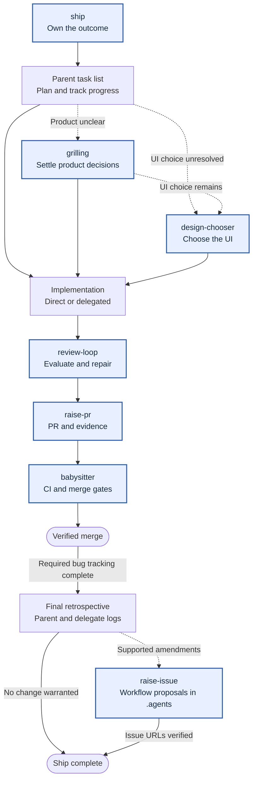
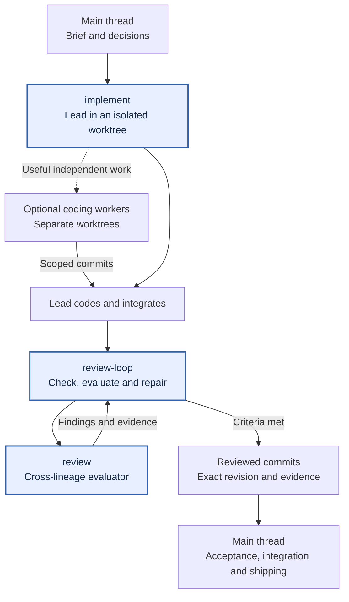
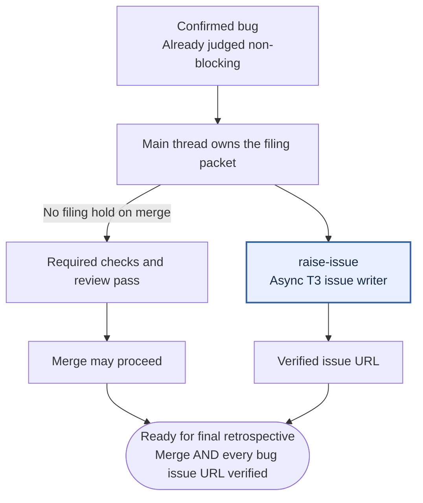

# .agents

A personal skill library for taking coding agents from an idea to a reviewed,
merged change.

The interesting part of agent-assisted development is deciding what deserves a
question, what can run independently, and what evidence is enough to ship.
This library makes those decisions explicit. Product interviews, UI choices,
isolated implementation, independent review and issue tracking each have a
small, readable skill with a clear handoff.

The main thread keeps the goal and owns the result. Delegates receive bounded
jobs. Review comes from a different model family. Confirmed bugs left for later
get tracking issues, even when they do not block the release.
Shipping also keeps a visible parent task list and ends with a retrospective
that proposes reusable workflow improvements as issues in this repository.

[Explore the skills](#skill-catalog) · [Try it](#use-the-library) · [Keep docs current](#documentation-that-tracks-the-code)

## Start with the outcome

```text
Ship a post-game replay for typing.football that plays the match in real time.
Grill me on unresolved product decisions and help me choose the UI.
```

That request gives the agent an outcome. It can choose the skills that help,
reuse decisions already made and skip unnecessary ceremony.


```mermaid
flowchart TD
    classDef skill fill:#e8f0ff,stroke:#315fa8,color:#152845,stroke-width:2px
    ship["ship<br/>Own the outcome"]:::skill
    plan["Parent task list<br/>Plan and track progress"]
    grilling["grilling<br/>Settle product decisions"]:::skill
    design["design-chooser<br/>Choose the UI"]:::skill
    implementation["Implementation<br/>Direct or delegated"]
    review_loop["review-loop<br/>Evaluate and repair"]:::skill
    raise_pr["raise-pr<br/>PR and evidence"]:::skill
    babysitter["babysitter<br/>CI and merge gates"]:::skill
    merge(["Verified merge"])
    retrospective["Final retrospective<br/>Parent and delegate logs"]
    proposals["raise-issue<br/>Workflow proposals in .agents"]:::skill
    finished(["Ship complete"])

    ship --> plan
    plan -. "Product unclear" .-> grilling
    plan -. "UI choice unresolved" .-> design
    grilling -. "UI choice remains" .-> design
    plan --> implementation
    grilling --> implementation
    design --> implementation
    implementation --> review_loop
    review_loop --> raise_pr
    raise_pr --> babysitter
    babysitter --> merge
    merge -->|"Required bug tracking complete"| retrospective
    retrospective -. "Supported amendments" .-> proposals
    retrospective -->|"No change warranted"| finished
    proposals -->|"Issue URLs verified"| finished
```

Blue boxes name skills; other boxes show steps or outcomes. Dashed branches are
conditional choices. They are not a required sequence or an
executable router. The skills are instructions the agent selects for the task.
This example follows a repository that uses PRs; a repository with a direct
publication policy keeps its prescribed delivery path.

**Settle the consequential choices.** [grilling](skills/grilling/SKILL.md) asks
about uncertainty that could change the next implementation step. It obtains
a cross-lineage readiness review before handing off. For unresolved visual or
interaction choices, [design-chooser](skills/design-chooser/SKILL.md) presents
mockups after product decisions are settled. The user chooses before UI work
begins. It defaults to two designer lineages, or three for a new screen, app or
unconstrained redesign. A missing lineage leaves the comparison incomplete
unless the user accepts a smaller set. An established design that answers the
question needs no new selection. Layout and minor edits preserve the existing
design and compare only the unresolved change. Reports give key decisions
stable feature IDs and keep options visible in separate frames. Controls must
work in the presentation host or show labelled static states. Invoking the
chooser authorises sharing its minimal design brief with the selected providers,
subject to standing limits.
Delegates receive that authority source. Broader raw-file sharing and host
approvals remain separate gates.

**Bring evidence to the review.** [review-loop](skills/review-loop/SKILL.md)
uses [review](skills/review/SKILL.md) for independent evaluation, evidence,
severity and finding dispositions. Visible changes need observed UI evidence.
For work headed to a PR, [raise-pr](skills/raise-pr/SKILL.md) applies early enough
to capture practical mobile and desktop before screenshots. Its placement near
the end of the diagram represents PR preparation, not its first invocation.

Review limits trigger a [progress diagnosis](skills/review/references/budget-exhaustion.md),
not an automatic request for more rounds. The coordinator checks whether repairs
are converging, stalled or cycling and recommends a concrete alternative, such
as a targeted reproduction, a different repair or a smaller proposed delivery.
An extension needs a specific purpose and stop condition. Existing review gates
and the user's scope still apply.

**Finish the authorised endpoint.** [ship](skills/ship/SKILL.md) carries the
change through checks, review and merge. [babysitter](skills/babysitter/SKILL.md)
handles current-head CI and review gates. A merge is evidence of a merge;
deployment and live acceptance need their own verification and authority.
Required human approvals and repository protections remain merge gates.

AI-written GitHub passages open with a visible byline. [github-writing](skills/github-writing/SKILL.md)
credits the model that drafted an issue, PR description, comment, review,
discussion or release note, even when another agent posts it:

```markdown
> [!NOTE]
> _Written by **GPT-6.1 Sol** on behalf of @seankoji_
```

The model and handle reflect the actual writer and represented operator.
Existing human text, code-author credits and reviewer disclosures remain
distinct. Commit attribution keeps its existing policy; the byline contains no
private session links.

## Keep implementation off the main thread

Use [implement](skills/implement/SKILL.md) when moving substantial coding into a
T3 delegate is worth the coordination cost. Its working lead codes directly and
delegates substantial independent parts when useful. Each coding worker has
its own prepared worktree and a non-overlapping scope.


```mermaid
flowchart TD
    classDef skill fill:#e8f0ff,stroke:#315fa8,color:#152845,stroke-width:2px
    main["Main thread<br/>Brief and decisions"]
    implement["implement<br/>Lead in an isolated worktree"]:::skill
    workers["Optional coding workers<br/>Separate worktrees"]
    integrate["Lead codes and integrates"]
    loop["review-loop<br/>Check, evaluate and repair"]:::skill
    reviewer["review<br/>Cross-lineage evaluator"]:::skill
    handoff["Reviewed commits<br/>Exact revision and evidence"]
    accepted["Main thread<br/>Acceptance, integration and shipping"]

    main --> implement
    implement -. "Useful independent work" .-> workers
    workers -->|"Scoped commits"| integrate
    implement --> integrate
    integrate --> loop
    loop --> reviewer
    reviewer -->|"Findings and evidence"| loop
    loop -->|"Criteria met"| handoff
    handoff --> accepted
```

Model selection inside `implement` aims for the lowest expected total cost that
meets the quality bar, including review, retries and repairs. A cheaper first
attempt is useful only if it can do the job. One evidenced model or effort
upgrade is allowed across the task; it does not reset the review budget.
If a material product or design decision emerges, the lead returns it to the
main thread and continues only independent work.

Independent review must use a lineage different from the coordinator and every
material model author. A different version of the same family does not count.
Outside `implement`, the default preference order lives in
[review](skills/review/SKILL.md). Named reviewer choices still have to be eligible.
The main thread can reuse an eligible completed review at the handoff. Integration
changes or a moved base require reassessing the affected evidence and review.
No measured cost or quality advantage is claimed by these instructions alone.

## Let non-blocking issue filing run alongside shipping

Every confirmed bug intentionally left unfixed needs a verified issue URL before
the execution workflow is complete. That includes minor SEV3 bugs. Rejected
findings and style preferences do not need issues, and filing does not lower
severity or waive a release blocker.

[raise-issue](skills/raise-issue/SKILL.md) prepares and files bugs, features and
tasks in owned, organisation and upstream repositories. It uses an asynchronous
T3 issue writer and reuses validated evidence. The top-level workflow owner
owns the job; child delegates return filing packets to that owner.


```mermaid
flowchart TD
    classDef skill fill:#e8f0ff,stroke:#315fa8,color:#152845,stroke-width:2px
    bug["Confirmed bug<br/>Already judged non-blocking"]
    packet["Main thread owns the filing packet"]
    issue["raise-issue<br/>Async T3 issue writer"]:::skill
    url["Verified issue URL"]
    gates["Required checks and review pass"]
    merge["Merge may proceed"]
    done(["Ready for final retrospective<br/>Merge AND every bug issue URL verified"])

    bug --> packet
    packet --> issue
    issue --> url
    packet -->|"No filing hold on merge"| gates
    gates --> merge
    merge --> done
    url --> done
```

The delivery endpoint and verified tracking for every deferred bug must both
finish before the final retrospective. A pending task handle is not an issue URL. The shared
[deferred-bug procedure](skills/review/references/deferred-bugs.md) owns the
details, including deduplication and evidence preservation.

Async dispatch follows the host's continuation rules. When T3 requires the main
agent to yield, hosted checks can continue, but the main agent does not keep
executing. For an otherwise-ready merge, it may merge first and dispatch filing
immediately afterward. The owner keeps tracking active until the URLs are verified.

## Make progress visible and learn from the run

`ship` owns the operator-visible task list in the parent context. It discovers
the native plan/todo tool, or a T3 MCP API that writes the same parent panel,
and records work, owners, dependencies, evidence and status there. It updates
the same list through handoffs and resumes. If neither tool is available, it
reports the gap and posts a concise parent-message status list at each phase change.
Delegate jobs and scheduled work are not substitutes for checklist items.

The last stage reads the ship invocation's operational activity across the
parent and every owned delegate, including descendants, failed attempts, reviews
and issue writers. The [retrospective procedure](skills/ship/references/retrospective.md)
defines the execution boundary, pagination, coverage record and bounded cutoff.
Missing logs remain an explicit gap; a summary alone is not full log coverage.

Supported amendments are pitched through `raise-issue` in the operator's
configured skill repository. For this owner that is `seankoji-com/.agents`.
Users of a clone or fork must explicitly name or configure their destination
before anything is posted; cloning this library grants no consent to publish
their project evidence in this owner's tracker.
Each needs redacted execution evidence, a broadly useful proposed rule, tradeoffs
and a validation case. The retrospective does not automatically change skills,
publish transcripts or manufacture proposals to meet a quota. Shipping ends
when the retrospective and any proposal issue URLs are verified, or with an
evidenced no-change result. Blocked stages stay visible in the task list.

## T3 permission compatibility

The shared [dispatch preflight](skills/agent-tuneup/references/t3-dispatch.md)
records an owner-reported T3 workaround. OpenCode, Grok and Muse must start with
explicit `full-access` for unattended work while their `auto` route falls back
to `ask`. T3 does not allow a child to exceed its parent's permissions, so a
parent in `auto`, including Codex/ChatGPT, cannot create those full-access delegates. Skills
filter incompatible routes before launch and preserve named-model constraints.

Codex/ChatGPT in full access may instead encounter an approval route mapped to
`never`. Operator questions use supported input tools; an impossible tool approval
is reported as a blocker. The workaround does not authorise changing global
permissions, bypassing host policy or silently switching a named model.

## Use the library

```sh
git clone https://github.com/seankoji-com/.agents.git
```

Point your host's native skill discovery at the clone's `skills` directory.
Keep that directory together: skills link to shared review rules and sibling
skills. Invoke a skill using the naming convention your host supports, such as
a slash command or its name in a request.

```text
Use grilling to help me settle how replay timing should work.
Use review to independently evaluate this implementation against the brief.
Ship this change through tests, review and merge.
```

Each skill is a folder with a `SKILL.md` entry point. Supporting references,
templates and helpers stay inside that folder. There is no install step to read
the instructions; Python helpers require Python 3.10+ and the standard library.

The library is written for T3 Code and Codex. Other hosts can use skills whose
required capabilities they provide. Isolated `implement` and asynchronous
`raise-issue` require T3 delegation. A missing route is reported as a blocker;
inline issue work requires an explicit request. Follow each skill's own fallback.

Read authority-bearing skills before invoking them. `ship` and `babysitter`
include scoped commits, pushes and protected merges. `implement` returns local
commits for the main thread to integrate. Explicit narrower limits always apply.
None of these grants permission to bypass repository protections.

Older releases through v0.13.2 contain archives from the previous package.
Use the current `skills` tree for the library described here.

## Skill catalog

Descriptions below come directly from each skill's metadata.

<!-- skill-catalog:start -->

| Skill | When to use it |
| --- | --- |
| [agent-docs](skills/agent-docs/SKILL.md) | Use when creating, editing or auditing a skill, AGENTS.md, CLAUDE.md or a doc they point to. |
| [agent-tuneup](skills/agent-tuneup/SKILL.md) | Use when the user asks to audit, troubleshoot or change agent configuration, permissions, MCP connections or native skill discovery. |
| [babysitter](skills/babysitter/SKILL.md) | Repair and merge requested pull requests. Use when asked to babysit, watch or monitor PRs, and honour explicit read-only and no-merge limits. |
| [bro](skills/bro/SKILL.md) | Restate the last message in plain human language, with no jargon. |
| [challenge](skills/challenge/SKILL.md) | Pressure-test an idea, design or proposal with an independent cross-lineage reviewer. Use when the user asks for an adversarial second opinion or to challenge assumptions; return findings without implementation. |
| [design-chooser](skills/design-chooser/SKILL.md) | Use after product decisions are settled for new UI, requested redesigns or material unresolved visual or interaction choices. For existing UI, preserve its design and limit choices to the requested change; routine edits need no chooser. |
| [focus-group](skills/focus-group/SKILL.md) | Use when the user requests a synthetic focus group or persona-based product evaluation, including planning, running or reviewing the study. |
| [github-writing](skills/github-writing/SKILL.md) | Use whenever drafting or editing LLM-written GitHub issues, pull requests, comments, reviews, discussions or release notes on the user's behalf. |
| [grilling](skills/grilling/SKILL.md) | Stress-test a plan, decision or idea through questions. Use when the user asks to be grilled or wants an interview to clarify their thinking. |
| [implement](skills/implement/SKILL.md) | Use when the user invokes implement or requests implementation through T3 delegates, returning reviewed commits for the main thread to integrate and ship. |
| [ketchup](skills/ketchup/SKILL.md) | Catch the user up on changes in this chat and every decision still waiting on them. Use for /ketchup. |
| [raise-issue](skills/raise-issue/SKILL.md) | Use when the user or an authorised workflow asks to investigate, prepare, file or follow up on a bug, feature or task issue in an owned, organisation or external repository, using an asynchronous T3 delegate. |
| [raise-pr](skills/raise-pr/SKILL.md) | Use whenever creating or updating a pull request, including during implementation, review-loop, ship and PR maintenance. |
| [review](skills/review/SKILL.md) | Use for independent cross-lineage reviews of plans, code, UI, backend and releases, including review-loop participants and grilling's stop-condition check. |
| [review-loop](skills/review-loop/SKILL.md) | Use when the user requests an iterative implementation, independent review and repair loop, or invokes review-loop to carry a goal to an agreed endpoint. |
| [ship](skills/ship/SKILL.md) | Use when the user explicitly asks to ship a change through delivery, visible progress tracking and a final workflow retrospective. |
| [test-writer](skills/test-writer/SKILL.md) | Use when writing or reviewing tests, choosing regression coverage, or assessing test value, reliability and CI runtime. |
| [unslop](skills/unslop/SKILL.md) | Cut AI tells from any writing. |

<!-- skill-catalog:end -->

## Documentation that tracks the code

```sh
python3 -B scripts/check_library.py
python3 -B -m unittest discover -s tests -v
```

The same checks run in CI and before owner publication. They enforce:

- Every registered skill appears exactly once in the generated catalog, with
  its current description. New source skills must be registered.
- Local Markdown links resolve, and annotated Mermaid skill nodes name real skills.
- Changes to skill instructions or their Markdown references invalidate the
  README's review receipt, requiring another look at the prose and diagrams.
- Skill metadata, entry-point budgets, helper imports and relocation contracts
  continue to pass the existing library checks.

After reviewing the README against changed instructions, refresh it with:

```sh
python3 -B scripts/check_library.py --update-readme --acknowledge-docs
```

The command regenerates the catalog and records the current instruction digest.
It preserves the hand-written prose and diagrams. A review receipt records an
acknowledgement; it cannot prove that a human or model checked every claim.
Tests do not establish Mermaid rendering, live model behaviour, installed skill
discovery or deployment success. Those need separate evidence.

People changing the library should also read [AGENTS.md](AGENTS.md).

<!-- skills-review: 8336dbc8a530a88b92b25cb196ad40465566ad719c791f48be0affa9f4572af1 -->

## Owner maintenance

This repository publishes by fast-forward updates to `main`; it does not use PRs
for its own maintenance. That repository policy is separate from the PR workflow
the skills support in other projects.

These commands are for the repository owner. Using the skills from a clone does
not require host-delivery configuration.

### Configure host delivery

Copy [.env.example](.env.example) to `.env` in the repository root, then replace
its synthetic destinations with SSH aliases or `user@host` destinations you control:

```sh
cp .env.example .env
```

Set `MAINTAIN_SYNC_HOSTS` to a whitespace-separated list. The loader reads this
setting from the file, not from shell environment variables. Real destinations
belong only in the local `.env`. Files matching `.env*`, including local variants
and editor backups, are ignored; `.env.example` is the sole checked-in exception.
Keep that example generic.

Each receiver keeps its source checkout at `~/.agents` and its discovery refresh script at
`~/.dotfiles/scripts/t3-workflow-skills.py`. Configure SSH keys, ports and jump
hosts through your SSH configuration. The receiving checkout must be clean, on
`main` and use the same origin as the publishing checkout.

`maintain.py` reads `.env` beside the script's repository, regardless of the
working directory. It accepts UTF-8 with or without a byte-order mark, quoted
values, comments beginning after whitespace and an optional `export` prefix for
`MAINTAIN_SYNC_HOSTS`. It does not execute shell code, expand variables
or export settings to subprocesses. Other settings are ignored. Missing, empty,
invalid or duplicate destinations stop publication before commits or pushes.
Validation and commit hooks need no local host configuration.

### Publish and retry delivery

```sh
python3 scripts/maintain.py check  # validate only
python3 scripts/maintain.py        # validate, commit, push and deliver to configured hosts
python3 scripts/maintain.py sync   # retry configured host delivery
```

The publication command stages current changes, obtains a commit message from
the local Codex CLI and pushes `main`. It then updates the owner's configured
checkouts with fast-forward updates, runs their tests and refreshes skill
discovery. It stops publication on failed local checks, a changing working tree
or a rejected push. A dirty receiver is left untouched, and delivery continues
to the other configured destinations. A partial delivery reports failure while
preserving the source commit, successful push and completed receiver updates.
Fix the reported receiver problem, then use `maintain.py sync` to retry delivery
without generating another commit.

In T3, the Publish action in `t3.json` runs the same owner workflow and requires
the same local `.env` setup. It does not supply destinations or bypass checks.
Organisation workflows remain in place. Publishing, receiver tests, discovery
refresh and fresh-session acceptance are separate results.

### Keep maintenance logs local

For a worktree-owned log, pass `--log-file` with a new path in an existing ignored
directory. The helper creates the file with owner-only permissions and refuses
to overwrite an existing file. Without this option it uses the system temporary
directory.

Local MCP settings, synced skill copies, marketplace state and machine wiring
are ignored. Keep them out of the public source; do not force-add ignored paths.

## License and security

[MIT licensed](LICENSE). Report vulnerabilities through the repository's
[private advisory form](https://github.com/seankoji-com/.agents/security/advisories/new).
If it is unavailable, follow the
[organisation security policy](https://github.com/seankoji-com/.github/blob/main/SECURITY.md).
Keep secrets and private logs out of public reports.
